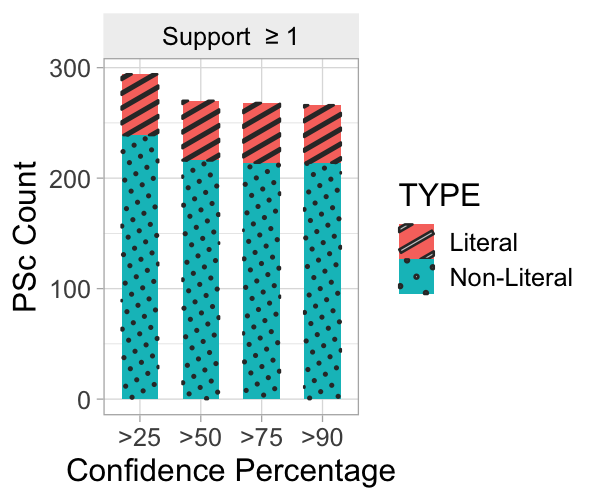
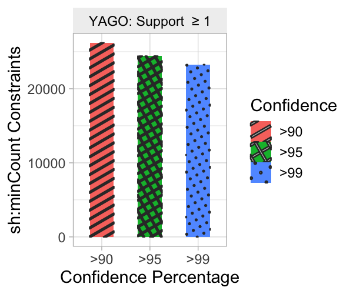

# Quality Shapes Extractor

**This repository contains the code for the following paper under submission in WWW-2022:**
> **Extracting Validating Shapes from very large Knowledge Graphs with Quality Guarantees**


In this paper, we propose a **Quality Shapes Extraction Approach (QSE)** to extract validating shapes from very large 
RDF graphs with quality guarantees. QSE is a support-based shapes-extraction approach which supports shapes extraction 
from knowledge graphs available as datafiles or in a triplestore as an endpoint denoted as **QSE-File** and **QSE-Endpoint**.


## Reproducibility Instructions

The following instructions are for reproducing the experiments we presented in our paper. To reproduce and extend the experiments you should clone the branch `master` on the Github repository as follows:

```
git clone https://github.com/kworkr/qse.git
```
The repository contains all code, and instructions. Dataset should be downloaded separately as explained below.


## Requirements
The experiments run on a _single machine_. To reproduce the experiments the suggested setup is:
- **Software:**
   - A GNU/Linux distribution (with git, bash, make, and wget)
   - Java version 15.0.2.fx-zulu

- **Hardware used in the experiments (and minimum required):**
   - RAM: 256 GB (minimum 16GB)
   - CPU: 16 cores (minimum 1) 
   - Disk space: ~100 GB free


## Getting the data
We have used DBpedia, YAGO-4, and LUBM datasets. Details on how we downloaded are given below:

1. **DBPedia:** We used our [dbpedia script](https://github.com/kworkr/qse/blob/master/download-dbpedia.sh) to download the dbpedia files listed [here](https://github.com/kworkr/qse/blob/master/dbpedia-files.txt).
2. **YAGO-4:** We downloaded YAGO-4 English version from [https://yago-knowledge.org/data/yago4/en/](https://yago-knowledge.org/data/yago4/en/).
3. **LUBM:** We used [LUBM-Generator](https://github.com/rvesse/lubm-uba) to generate LUBM-500.


We provide a copy of all our datasets in a [single archive](http://130.226.98.152/www_datasets/). You can download these datasets in `data` folder, and check the size and number of lines (triples) with the following commands:

```
 cd data 
 du -sh yago.n3 or dbpedia.n3 or yago.n3
 wc -l yago.n3 or dbpedia.n3 or yago.n3
```

## Software Setup

1. Install Java
   Follow [these](https://sdkman.io/install) steps to install sdkman and execute the following commands to install the specified version of Java.

        sdk list java
        sdk install java 11.0.10.fx-zulu 
        sdk use java 15.0.2.fx-zulu 

2. Install gradle

        sdk install gradle 6.8.3

3. Build project

        gradle clean
        gradle build
        gradle shadowJar


4. Install GraphDB by following the instructions listed [here](https://graphdb.ontotext.com/).


## Experimentation
Here we explain how to repeat experiments and the output (numbers) presented in the evaluation section of our paper.


#### How to repeat experiments?

Update the following parameters in the [config](https://github.com/kworkr/qse/blob/master/config.properties) file to setup configuration for **QSE-File** approach:

```
 QSE_File_Schema_Extractor=true, dataset_path, expected_number_classes, expected_number_of_lines, dataset_name,  QSE_Endpoint_Schema_Extractor=false
```
To run **QSE-Endpoint** approach, you will have to set the following paramteres as well:

```
QSE_Endpoint_Schema_Extractor=true, graphDB_URL and graphDB_REPOSITORY, QSE_File_Schema_Extractor=false
```
We have already prepared 3 config files for each of our dataset, you can use these files to run the experiments using the following commands:
```
java -jar -Xmx16g  build/libs/qse.jar dbpediaConfig.properties &> dbpedia.logs
java -jar -Xmx16g  build/libs/qse.jar yagoConfig.properties &> yago.logs
java -jar -Xmx16g  build/libs/qse.jar lubmConfig.properties &> lubm.logs
```

### Outputs and statistics

All tests will produce `.csv` (statistics) and `.ttl` (default and pruned shapes) files in the [Output](https://github.com/kworkr/qse/tree/master/Output) directory. We have extracted values for default shapes statistics from the output csv files and created a table below (also presented in the paper as Table 2):

|         | Node Shapes |   Node Shape Properties  | Non-Literal (sh:class) constraints | Literal Constraints | sh:minCount Constraints |
|---------|-------------|:------------------------:|:----------------------------------:|:-------------------:|:-----------------------:|
|         |    COUNT    |     COUNT/AVG/MAX/MIN    |          COUNT/AVG/MAX/MIN         |  COUNT/AVG/MAX/MIN  |    COUNT/AVG/MAX/MIN    |
|    **LUBM** |      23     |    164 / 7.13 / 15 / 1   |         323 / 3.02 / 14 / 1        |     57 /1 /1 /1     |       136 /1 /1 /1      |
| **Dbpedia** |     426     | 11,916 / 27.97 / 330 / 1 |       38,454 / 6.96 / 268 / 1      |    5,335 /1 /1 /1   |       235 /1 /1 /1      |
|  **YAGO-4** |    8,897    |  76,765 / 8.62 / 128 / 1 |     315,413 / 14.54 / 1341 / 1     |  50,708 / 1 / 3 / 1 |     25,213 /1 /1 /1     |

Further, we used the output values to plot charts for each dataset to perform pruning analysis performed by QSE approach shown below. 
You can find these charts and the output values in [directory](https://github.com/kworkr/qse/tree/master/charts).

#### Pruning Analysis by QSE approach on DBpedia:

Property Shape Constraints             |  Property Shapes      |  Node Shapes
:-------------------------:|:-------------------------:|:-------------------------:
  |  | 


#### Pruning Analysis by QSE approach on YAGO-4:

Property Shape Constraints             |  Property Shapes      |  Node Shapes
:-------------------------:|:-------------------------:|:-------------------------:
  |  | 

#### Pruning Analysis by QSE approach on LUBM:

Property Shape Constraints             |  Property Shapes      |  Node Shapes
:-------------------------:|:-------------------------:|:-------------------------:
  |  | 


#### Min Cardinality Analysis:
DBpedia             |  YAGO-4     |  LUBM
:-------------------------:|:-------------------------:|:-------------------------:
  |  | 
